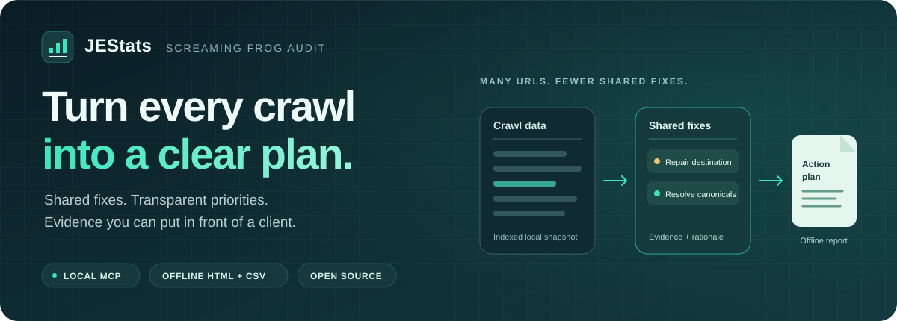
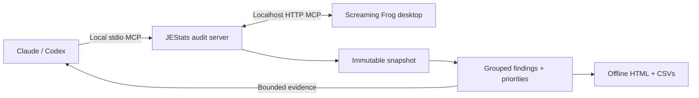

<p align="center">
  
</p>

<div align="center">

# JEStats Screaming Frog Audit

**From crawl data to a prioritized, evidence-backed SEO action plan.**

A free, open-source local MCP plugin for Claude Desktop, Claude Code, and Codex.

[](LICENSE)
[](package.json)
[](docs/setup.md)
[](docs/compatibility.md)

[](https://github.com/jestatsio/screamingfrog-plugin/releases/download/v0.1.1-preview.1/jestats-screamingfrog-audit-0.1.1-preview.1.mcpb)
[](https://jestatsio.github.io/screamingfrog-plugin/#codex)
[](https://jestatsio.github.io/screamingfrog-plugin/#claude-code)

[Choose your assistant](https://jestatsio.github.io/screamingfrog-plugin/) · Prebuilt development preview · No repository build required

[Get started](#get-started) · [Sample report](#explore-the-report) · [Tools](#nine-tools-one-workflow) · [Validation](#what-is-verified) · [Contribute](#develop-and-contribute)

</div>

> **Provisional v0.1.1.** A controlled licensed macOS audit works end to end. Windows native integration, all six assistant/OS installation journeys, applied preset settings, analysis readiness, and manual offline browser interaction remain release gates. See the [compatibility matrix](docs/compatibility.md).

## One request. A clear action plan.

> “Audit this site and give me a client-ready action plan.”

Start a new crawl or choose a saved Screaming Frog database crawl. JEStats extracts a consistent local snapshot, computes findings and priorities, and gives your assistant bounded evidence to explain what to fix next.

The goal is simple: **hundreds of affected URLs reduce to a handful of shared fixes.** Grouping by destination, issue signature, and site section is deterministic. Suspected template causes stay labeled as hypotheses.

| Understand the problem | Choose the next fix | Share the evidence |
| :--- | :--- | :--- |
| Related URLs grouped into actionable findings | Transparent severity, confidence, reach, and internal-link importance | A branded, interactive HTML report with supporting CSVs |
| Observed failures separated from metadata opportunities | Missing traffic metrics remain unknown | Local assets, paginated details, and offline operation |

## Explore the report

The included **synthetic demonstration has 1,600 URLs and six findings**. It shows shared broken links, redirects, canonical targets, sitemap conflicts, and metadata opportunities without making claims about a real website.

**[Download the sample HTML](https://github.com/jestatsio/screamingfrog-plugin/raw/refs/heads/main/sample/report.html)** and open it locally. GitHub's file view displays the source. You can also generate it with `npm run sample`.

[Browse report source](sample/report.html) · [Finding CSV](sample/findings.csv) · [URL CSV](sample/urls.csv) · [Synthetic fixture](sample/fixture.ts)

The report includes an executive overview, category charts, prioritized fixes, filters by priority/category/site section, and paginated affected URLs. Each finding exposes its evidence, remediation guidance, and priority rationale. Client and site names are customizable; assistant narrative links to finding IDs and cannot override computed facts.

## Get started

### 1. Prepare Screaming Frog

Open a **licensed Screaming Frog SEO Spider** with native MCP support, use **database storage mode**, and enable MCP under **File → Settings → MCP Server**. Keep the application running and visible. The usual endpoint is `http://127.0.0.1:11435/mcp`.

Licence activation stays in Screaming Frog. No JEStats cloud account or account-linking flow is required. See the [official native MCP guide](https://www.screamingfrog.co.uk/seo-spider/user-guide/configuration/#mcp-server).

### 2. Install the preview

Use the buttons above or the **[installation page](https://jestatsio.github.io/screamingfrog-plugin/)**. The packages include the compiled server, its dependencies, and the audit workflow. Claude Desktop supplies its Node.js runtime; Codex and Claude Code need **Node.js 20+** available locally.

| Assistant | Quick install |
| :--- | :--- |
| **Claude Desktop** | Download the `.mcpb`, open it, and confirm **Install** |
| **Claude Code** | Paste `/plugin install jestats-screamingfrog-audit --marketplace jestatsio/screamingfrog-plugin` in a current session, then confirm installation |
| **Local Codex** | Register the community marketplace once, then use the install page's **Open in Codex** button or the CLI install command |

Codex's app link opens installation details for an already registered marketplace. The [installation guide](docs/setup.md) includes the two first-time commands, supported host versions, manual alternatives, and updates. Installation and complete audit usability still need verification in each host/OS combination; see the [compatibility matrix](docs/compatibility.md).

Download archives and checksums from the **[development prerelease](https://github.com/jestatsio/screamingfrog-plugin/releases/tag/v0.1.1-preview.1)**. This is a JEStats community distribution; official directory submissions and a validated release remain pending.

### 3. Ask for an audit

Ask your assistant to check the connection, select a saved database crawl or start a new one, and produce the action plan. New crawls use the bundled [technical-audit preset](presets/technical-audit-v1.md). Advanced users can provide an exported `configPath` or explicitly choose `useCurrentConfig: true`.

Retain the audit ID. The assistant advances its checkpoints with `audit_status`, queries the evidence, and calls `render_report` for the local HTML and CSV paths. Jobs persist across reconnects; there is no background worker while the assistant is disconnected.

## How it works



Screaming Frog supplies crawl control and source data. JEStats supplies consistent acquisition, deterministic analysis, shared-fix grouping, and report generation. Native operations are serialized across plugin processes, and crawl identity is checked throughout extraction to reject interrupted or mixed snapshots.

| Audit area | Initial coverage |
| :--- | :--- |
| **Broken links** | Internal hyperlinks to failing destinations, grouped with linking pages |
| **Redirects** | Chains, loops, and lower-priority internal redirect opportunities |
| **Canonicals & indexability** | Conflicting declarations and problematic canonical targets |
| **Sitemaps** | Broken or non-indexable sitemap URLs, when sufficient data exists |
| **Metadata** | Missing or duplicate titles, descriptions, and heading opportunities |

Intentional `noindex` alone is informational. Metadata opportunities are distinct from definite technical failures. Insufficient source data produces a visible coverage gap; dependent checks remain unassessed. Read the [evidence and prioritization rules](docs/prioritization.md).

## Nine tools, one workflow

| Tools | Responsibility |
| :--- | :--- |
| `connection_status` · `list_crawls` | Diagnose setup and select a source |
| `start_audit` · `list_audits` | Create and rediscover persisted jobs |
| `audit_status` · `control_audit` | Reconcile, advance, pause, resume, or cancel |
| `list_findings` · `finding_details` | Query bounded findings and paginated evidence |
| `render_report` | Generate local HTML and supporting CSV exports |

Cancellation is recorded locally even during a disconnect. Native pause is attempted only for the job's exact owned crawl; diagnostics disclose when the application may still be crawling.

## Local by design, explicit about limits

- **100,000 URLs maximum.** Larger crawls fail explicitly; rows are never silently sampled.
- **128 MiB per dataset.** Separate budgets apply to selected extraction, link evidence, normalized snapshots, analysis candidate/finding data, and report payloads.
- **Local storage.** Jobs, indexed NDJSON snapshots, and reports default to `~/.jestats/screamingfrog`; override with `JESTATS_AUDIT_DATA_DIR`.
- **Bounded assistant responses.** Full datasets and exhaustive link graphs stay outside the conversation. Your chosen assistant provider receives the bounded tool responses under its own policies.
- **Offline reports.** Scripts, styles, and compressed report data are bundled locally. Raw page HTML and exhaustive link graphs are excluded.

`SCREAMINGFROG_MCP_URL` can override the native endpoint and must remain loopback HTTP. Initial targets are local macOS and Windows clients. Remote/cloud execution, Linux, arbitrary saved crawl files, and unattended monitoring are outside this version's scope.

## What is verified

**Local validation snapshot — September 29, 2026.** Version 0.1.1 adds the storage-path repair and regression checks; the licensed macOS crawl observations below were recorded with 0.1.0. Rerun checks for the revision you use.

| Check | Observed result |
| :--- | :--- |
| Typecheck, build, and fixture suite | **216 tests passed** locally, including storage-path regression and prebuilt packaging checks |
| Claude Desktop storage default | Blank settings and the exact legacy `${HOME}/.jestats/screamingfrog` value resolve to the Node home directory; fixture MCP starts persist and list audit jobs |
| Licensed macOS SEO Spider 24.3 | New crawl, stable identity, pagination, reconnect, and saved-crawl reload reconciliation passed |
| New/saved audit equivalence | **13 identical snapshot rows and 14 findings**, with matching snapshot hashes |
| Actual stdio MCP workflow | Nine tools discovered; bounded evidence queried; HTML and both CSVs generated |
| Prebuilt distribution | All four extracted packages expose nine tools without installing dependencies; generated Claude marketplace and plugin pass strict validation |
| Synthetic scale benchmark | **100,000 URLs / 2,000 findings**; 2.74 MB HTML generated in **459.3 ms** in Node.js |
| Dependency audit | Zero reported vulnerabilities at that snapshot |

The [0.1.1 storage-fix record](docs/validation-0.1.1.json) preserves the new regression results; the [original validation record](docs/validation-2026-09-29.json) preserves the native observations and outstanding release gates.

The benchmark measures Node generation and indexed lookups; **browser responsiveness remains unverified**. The genuine macOS preset export was accepted by native MCP, but its applied settings still need verification. A recorded configuration hash observes file bytes before launch; it does not prove that Screaming Frog applied them. Progress percentages alone do not establish analysis readiness.

The [compatibility matrix](docs/compatibility.md) and [native verification checklist](docs/native-verification.md) track the remaining gates. CI checks fixture builds and packaging on macOS and Windows; it does not verify licensed native installations or assistant usability.

## Develop and contribute

Use **Node.js 20.19+, 22.12+, or 24+** for development:

```sh
git clone https://github.com/jestatsio/screamingfrog-plugin.git
cd screamingfrog-plugin
npm ci
npm run check
```

```sh
npm run check             # Typecheck, build, and fixture tests
npm run probe:native      # Read-only native schemas, status, and recent crawls
npm run verify:native     # Read-only verification record
npm run sample            # Regenerate the synthetic HTML and CSVs
npm run benchmark         # Synthetic 100,000-URL Node benchmark
npm run package:plugins   # Build and package all three assistant formats
```

Controlled crawl verification changes the visible native application; follow the [native checklist](docs/native-verification.md) before running its mutation flags. Reports require a modern browser with `DecompressionStream` support. Manual local-file checks are still pending.

Useful contributions include Windows native verification, assistant installation checks, offline report feedback, and evidence-backed improvements to analysis rules. Open an [issue](https://github.com/jestatsio/screamingfrog-plugin/issues) or a [pull request](https://github.com/jestatsio/screamingfrog-plugin/pulls) with reproducible details.

<div align="center">

**JEStats · Evidence before advice.**

[MIT licensed](LICENSE) · Free and open source · An independent integration, not an official Screaming Frog product

</div>
